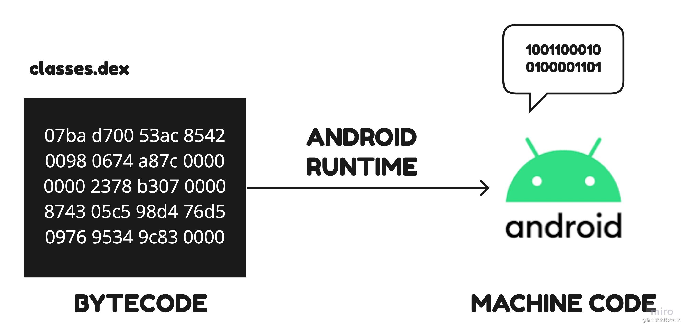
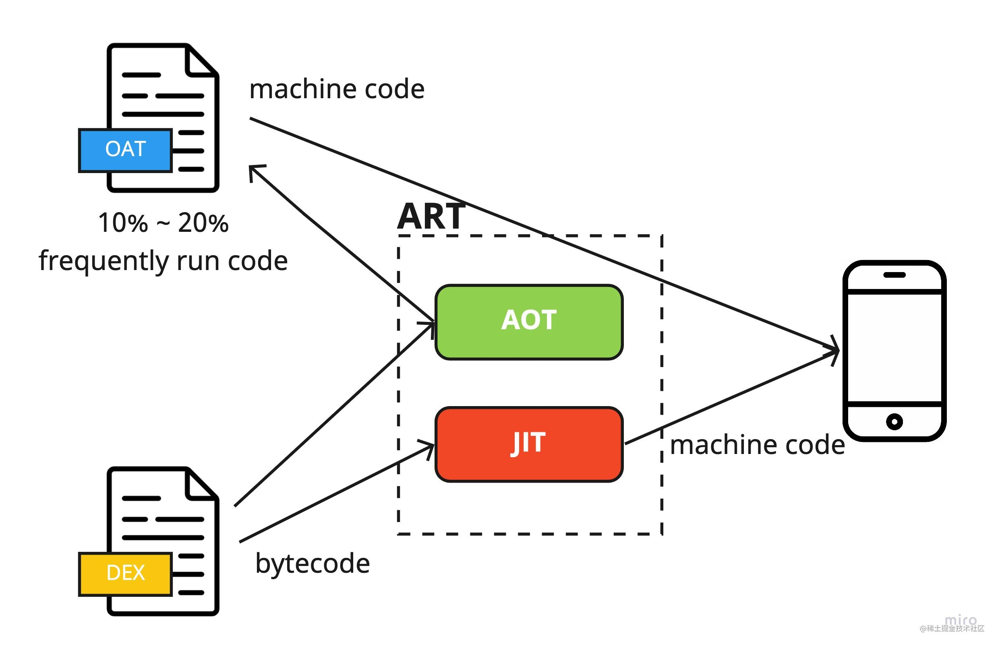
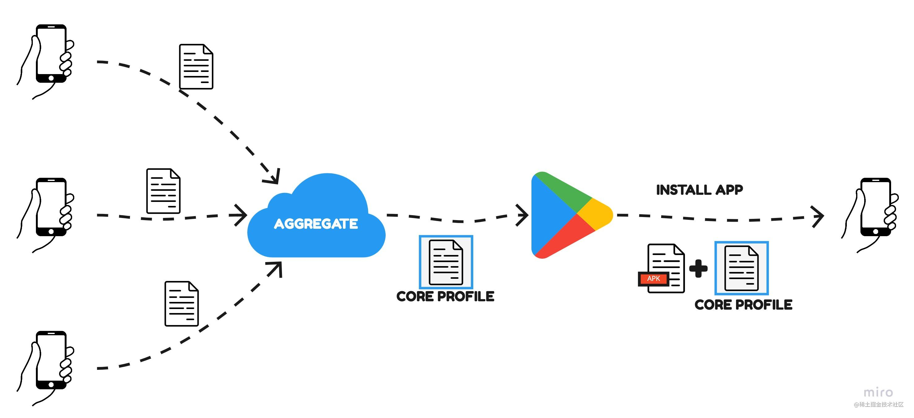
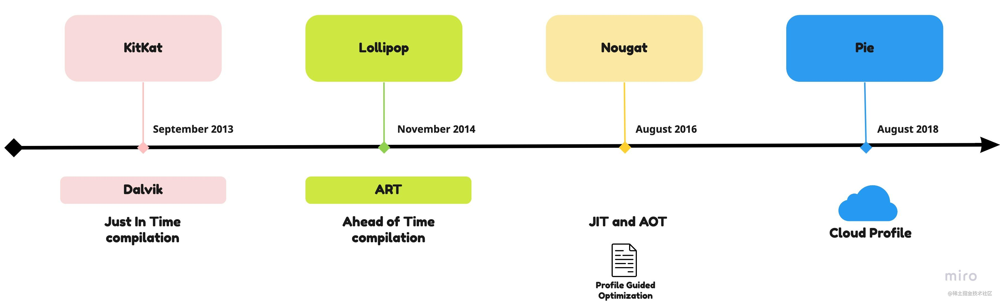

Android Runtime 是 Android 生态系统中最核心的一部分，你们可能听说过这些词：**Dalvik、ART、JIT、 AOT**。本文将介绍这些词的具体含义以及 Android Runtime 如何使应用运行的更快。

## Android Runtime (ART)

当我们打包应用程序并生成 APK 文件时，该 APK 的一部分是 **.dex 文件**。这些文件包含应用程序的源代码和依赖的库，以**字节码**的形式存在。

当用户运行应用程序时，Android Runtime 把 .dex 文件中的字节码翻译成**机器码**——一组指令，机器可以直接理解并由 CPU 处理。

有很多将字节码编译成机器码的策略，但是所有的策略都是权衡利弊的结果。从 Android 的发展历史去回顾可以让我们更好地理解这些策略。

让我们回到几年前，先了解 Dalvik。

## Dalvik
早期 Android 手机的配置没有现在这么强大，大多数手机只有很少的 RAM。Dalvik 在实现时主要是为了优化 RAM 的占用。因此，Dalvik 没有在运行之前将整个应用程序编译为机器代码，而是使用了称为 **Just In Time compilation** 的策略，简称 **JIT**。在这个策略中，编译器有点像解释器。它在应用程序执行期间（在运行时）编译一部分代码，所以可以节省大量 RAM。

但是这种策略有一个严重的缺点——因为这一切都发生在运行时，显然会对运行时性能产生负面影响。最终，引入了一些优化来提高 Dalvik 的性能。将一些经常执行的编译过的代码缓存起来，不再重新编译。但这非常有限，因为早期的 RAM 非常稀缺。

随着手机的性能越来越好， RAM 也越来越大，而应用程序也变得越来越庞大，JIT 的影响变得越来越严重。所以在 Android L 中引入了新的 Android Runtime - **ART**。

## Android Runtime (ART) 
ART 的工作方式和 Dalvik 完全不同，不再使用 Just in Time 编译，而是使用一种称为 **Ahead of Time compilation (AOT)** 的策略。在 ART 中，代码是在运行应用程序之前编译的，而不是在运行时解释代码，当应用程序运行时，机器代码已经准备好了。

这种策略极大的提高了运行时性能。但是缺点也显而易见， ART 中 RAM 的使用比 Dalvik 中多得多。另一个缺点是安装应用程序需要更多时间，因为在安装 APK 时整个应用程序需要转换为机器代码。

对于应用程序中经常运行的部分，预编译显然是值得的，但现实是应用程序的大部分页面很少被用户打开，预编译整个应用程序回报率太低。

这就是为什么在 Android N 中，将 JIT 与 PGO (Profile Guided Optimization) 一起引入到 Android Runtime。

## Profile Guided Optimization (PGO)
配置文件引导编译是一种策略，可以在运行时不断提高 Android 应用程序的性能。默认情况下，应用程序使用**Just in Time 编译**策略进行编译，但是当 ART 检测到某些方法是“热”的，即它们运行频繁时，ART 可以预编译并缓存这些方法以达到最佳性能。

这个策略使应用的关键部分提升到最佳性能，同时减少 RAM 的使用，而且不再影响应用的安装速度。因为对于大多数应用来说，只有10%～20%的代码被频繁使用。

这个策略的缺点是为了获取配置文件数据并编译常用的方法和类，用户必须实际使用应用。这意味着应用在首次使用时可能会有点慢。

## Cloud Profile
云配置文件的主要思想是大多数人以非常相似的方式使用应用。因此，为了安装后立即提高性能，可以从已经使用过该应用的用户那里收集数据。聚合之后的数据用于为应用创建一个通用核心配置文件 (common core profile)。

所以，当新用户安装应用时，此文件会与应用一起下载。 ART 使用它来预编译大多数用户经常运行的类和方法。这样新用户在下载应用后就能立即获得更好的性能。用户运行应用后，ART 将收集用户特定的配置文件数据并重新编译该用户经常使用的代码。最好的一点是，开发人员无需执行任何操作，这一切都发生在 Android Runtime 的内部。

## 总结
Android Runtime 负责将作为 APK 的一部分的字节码编译为 CPU 可以直接理解的特定设备的机器码。

第一个 Android Runtime 实现称为 **Dalvik**，它使用**即时编译（JIT）** 来优化 RAM 的使用。

为了提高 Android L 的性能，引入了使用**提前编译（AOT）** 的 ART。 这允许实现更好的运行时性能，但会导致更长的安装时间和更多的 RAM 使用。

在 Android N 中，**JIT** 被重新引入到 ART 中，并且**配置文件引导优化（PGO）** 允许为频繁运行的代码实现更好的性能。

在 Android P 中，为了实现安装应用程序后立即获得最佳性能，引入了云配置文件，通过添加与 APK 一起下载的**通用核心配置文件**来进一步优化。

所有这些优化让 Android Runtime 尽可能地提高应用的性能。

## 参考
- [How ART works](https://source.android.com/docs/core/runtime/configure#how_art_works)
- [Implementing ART just-In-time (JIT) Compiler](https://source.android.com/docs/core/runtime/jit-compiler)