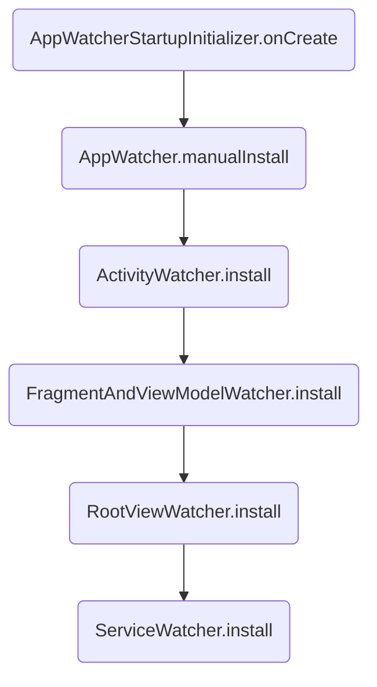

## 1. leakcanary 初始化过程

## 2. Java 强引用，弱引用，软引用，虚引用
|||
|----|----|
|强引用 | 绝不回收|
|软引用 | 内存不足才回收|
|弱引用 | 碰到就回收|
|虚引用 | 等价于没有引用，只是用来标识下指向的对象是否被回收|

## 3. leakcanary 基本原理

以上内容部分参考自 https://blog.csdn.net/c10WTiybQ1Ye3/article/details/122954616